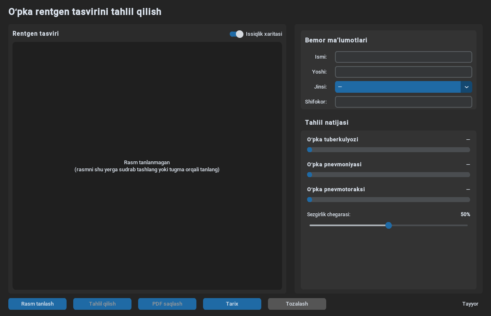
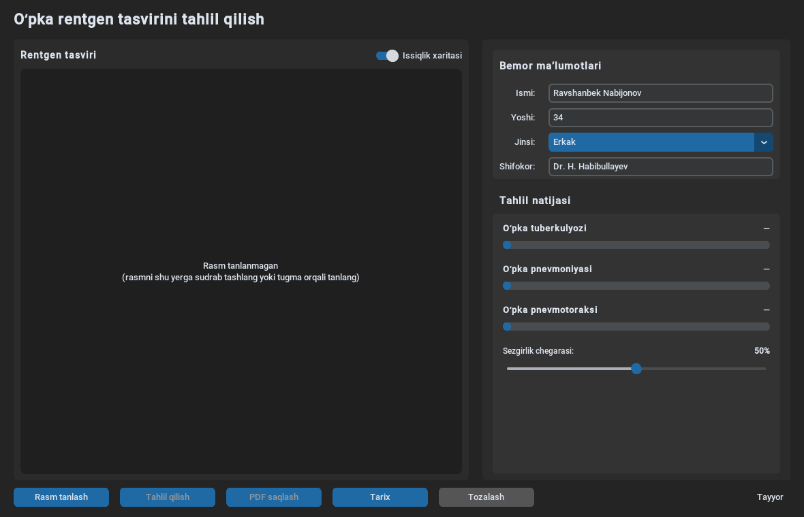
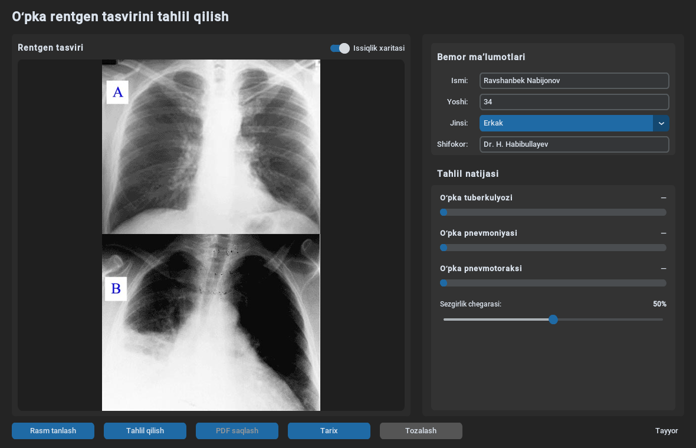
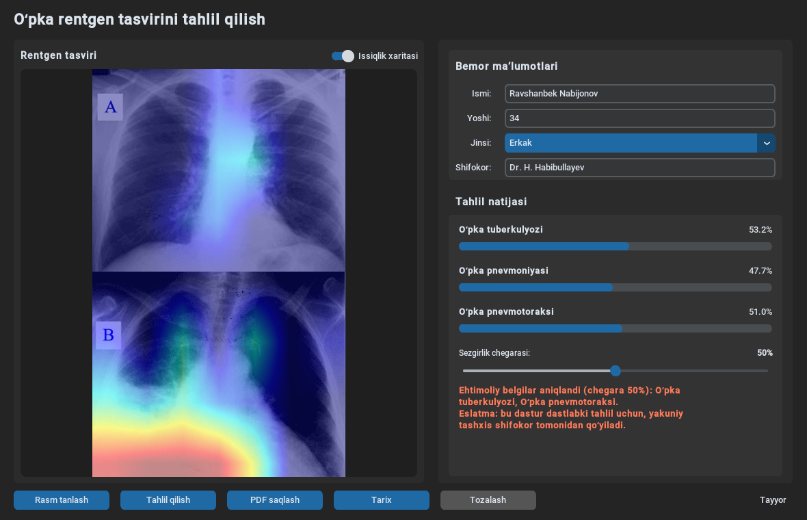
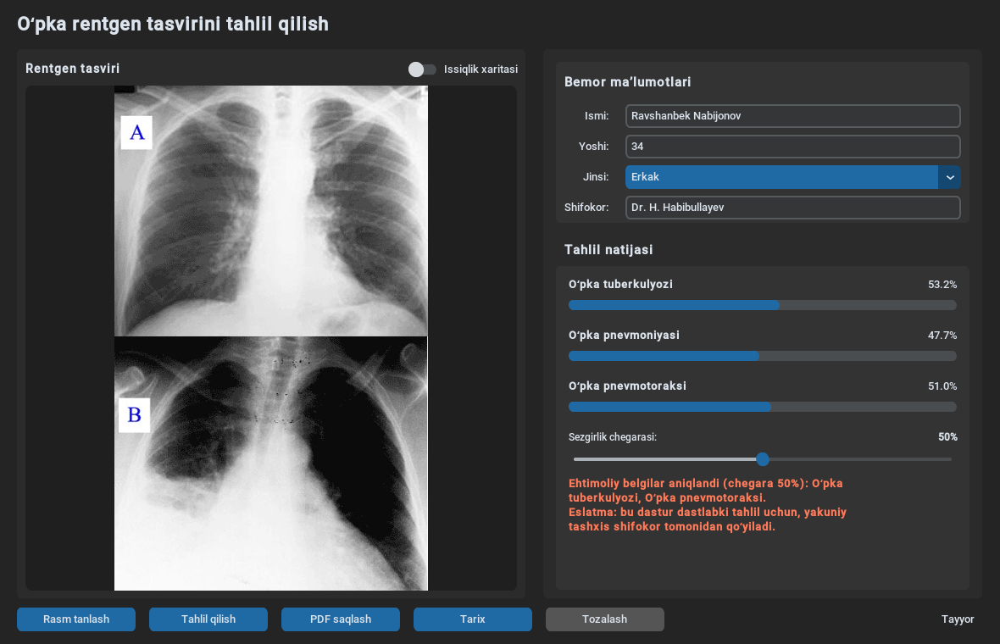
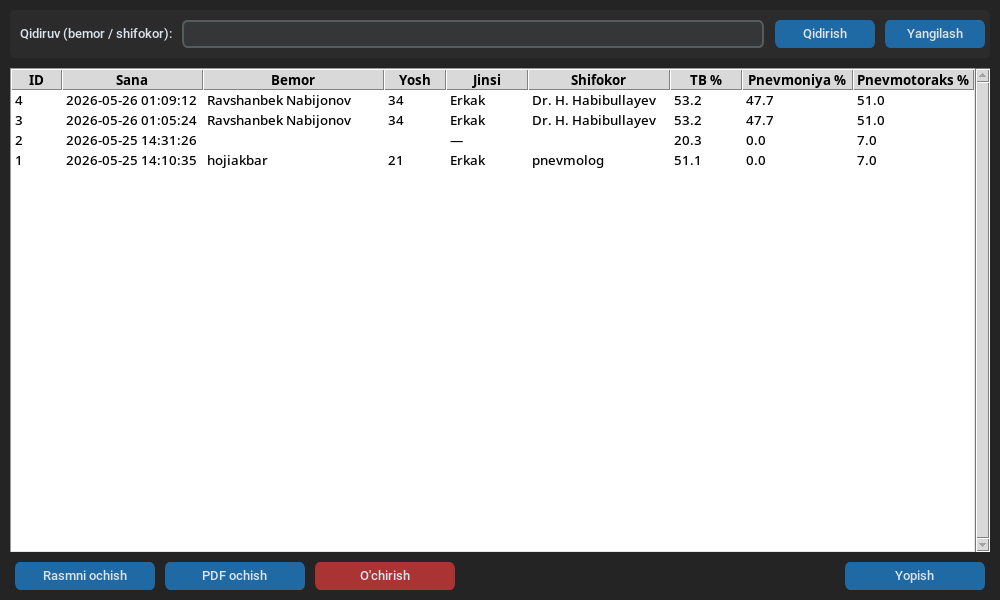

# Tahlil — Foydalanuvchi qoʻllanmasi

**Tahlil** — oʻpka rentgen tasvirini sunʼiy intellekt yordamida tahlil qiluvchi desktop dasturi. Dastur uchta kasallik belgilarini aniqlashga moʻljallangan:

- Oʻpka tuberkulyozi
- Oʻpka pnevmoniyasi
- Oʻpka pnevmotoraksi

> **Eslatma:** Dastur dastlabki tahlil uchun yordamchi vositadir. Yakuniy tashxisni har doim shifokor qoʻyadi.

---

## 1. Oʻrnatish

### 1.1. Windows uchun tayyor `.exe` (tavsiya etiladi)

1. Eng oxirgi versiyani [GitHub Releases](https://github.com/hojiakbar-python/tahlil/releases) sahifasidan yoki Actions artefaktlaridan yuklab oling: `tahlil.exe`
2. Faylga ikki marta bosing — dastur ishga tushadi. Birinchi ishga tushishda model yuklanishi 1–2 daqiqa olishi mumkin (taxminan 275 MB).

### 1.2. Manba kodidan ishga tushirish (Linux / macOS / Windows)

```bash
git clone https://github.com/hojiakbar-python/tahlil.git
cd tahlil
python -m venv venv
source venv/bin/activate          # Windows: venv\Scripts\activate
pip install -r requirements.txt
python main.py
```

**Talablar:** Python 3.10+, internet aloqasi (birinchi ishga tushishda model yuklanadi).

---

## 2. Asosiy oyna

Dastur ishga tushgandan keyin quyidagi oynani koʻrasiz. Oynaning ikki paneli bor:

- **Chap panel** — rentgen rasm va issiqlik xaritasi
- **Oʻng panel** — bemor maʼlumotlari va tahlil natijalari
- **Pastki qator** — boshqaruv tugmalari



Oʻng pastki burchakda **"Tayyor"** yozuvi paydo boʻlsa — model yuklandi va dastur ishga tayyor.

---

## 3. Bemor maʼlumotlarini kiritish

Oʻng panelda **Bemor maʼlumotlari** boʻlimini toʻldiring:

- **Ismi** — bemorning toʻliq ismi
- **Yoshi** — yoshi
- **Jinsi** — Erkak / Ayol
- **Shifokor** — tahlilni oʻtkazgan shifokor ismi

Bu maʼlumotlar keyinchalik PDF hisobotda va tarixda saqlanadi.



---

## 4. Rasmni yuklash

Rentgen tasvirini ikkita usulda yuklashingiz mumkin:

1. **"Rasm tanlash"** tugmasini bosib, kompyuterdan tanlash
2. **Sudrab tashlash (drag & drop)** — rasmni toʻgʻri chap paneldagi katakka tashlash

Qoʻllab-quvvatlanadigan formatlar: `.png`, `.jpg`, `.jpeg`, `.bmp`, `.tif`, `.tiff`

Rasm yuklangach, **"Tahlil qilish"** tugmasi faollashadi.



---

## 5. Tahlil natijasi va issiqlik xaritasi

**"Tahlil qilish"** tugmasini bosing. Bir necha soniyada model uchta kasallik uchun ehtimollik foizini chiqaradi.

- Har bir kasallik yonidagi **progress bar** va **foiz** — modelning ishonch darajasi.
- **Sezgirlik chegarasi** slayderi (30%–70%) — qanday foizdan boshlab "ehtimoliy belgi" deb hisoblashni belgilaydi.
- Pastdagi **xulosa matni** chegaraga koʻra qaysi kasalliklar ehtimoliy belgi koʻrsatganini sanab beradi.

Issiqlik xaritasi (Grad-CAM) model qaysi sohaga eʼtibor berganini koʻrsatadi — qizil/sariq joylar diqqat markazidagi hududlar.



**"Issiqlik xaritasi"** kalitini oʻchirsangiz, faqat xom rentgen tasvirini koʻrasiz:



---

## 6. Tarix oynasi

**"Tarix"** tugmasi orqali avval qilingan barcha tahlillarni koʻrishingiz mumkin. Bu yerda:

- Bemor ismi yoki shifokor boʻyicha **qidirish**
- Tahlilda ishlatilgan **rasmni ochish**
- Saqlangan **PDF**ni ochish
- Yozuvni **oʻchirish**



Maʼlumotlar `tahlil_tarix.db` faylida (SQLite) saqlanadi.

---

## 7. PDF hisobot

Tahlildan soʻng **"PDF saqlash"** tugmasi faollashadi. Bosing va saqlash joyini tanlang. PDFda quyidagilar boʻladi:

- Bemor maʼlumotlari va sana
- Tahlil natijalari (foizlar bilan)
- Yakuniy xulosa matni
- Original rentgen tasviri va issiqlik xaritasi
- Eslatma: yakuniy tashxis shifokor tomonidan qoʻyiladi

PDF fayllar `hisobotlar/` papkasiga avtomatik nom bilan saqlanadi (`tahlil_<bemor>_<sana>.pdf`).

---

## 8. Tugmalar qisqacha

| Tugma | Vazifasi |
|-------|----------|
| **Rasm tanlash** | Kompyuterdan rentgen rasmni tanlash |
| **Tahlil qilish** | Yuklangan rasmni AI bilan tahlil qilish |
| **PDF saqlash** | Natijani PDF hisobot sifatida saqlash |
| **Tarix** | Avvalgi tahlillar roʻyxati |
| **Tozalash** | Joriy bemor maʼlumotlari va rasmni tozalash |

---

## 9. Tez-tez beriladigan savollar

**Birinchi ishga tushishda nima uchun sekin?**
Model (`torchxrayvision` — DenseNet-121) birinchi marta internetdan yuklab olinadi (~50 MB). Keyingi ishga tushirishlarda kesh ishlatiladi.

**Tahlil natijasi 100% aniqmi?**
Yoʻq. Bu yordamchi vosita. Model ehtimollikni baholaydi, lekin yakuniy tashxis har doim malakali shifokor tomonidan qoʻyilishi shart.

**Maʼlumotlarim qaerda saqlanadi?**
Hammasi lokal: `tahlil_tarix.db` (SQLite ma'lumotlar bazasi) va `hisobotlar/` papkasidagi PDF fayllar. Hech narsa internetga yuborilmaydi.

**Issiqlik xaritasi nima?**
Grad-CAM texnikasi yordamida model qaysi piksellarga eʼtibor berganini koʻrsatadi. Diagnostika emas — tushuntiruv vositasi.

---

## 10. Texnik maʼlumot

- **Model:** [TorchXRayVision](https://github.com/mlmed/torchxrayvision) DenseNet-121 (oldindan oʻrganilgan)
- **Tushuntirish:** [Grad-CAM](https://github.com/jacobgil/pytorch-grad-cam)
- **GUI:** [CustomTkinter](https://github.com/TomSchimansky/CustomTkinter)
- **PDF:** [ReportLab](https://www.reportlab.com/)
- **Build:** PyInstaller + GitHub Actions (Windows `.exe`)

Manba kodi: <https://github.com/hojiakbar-python/tahlil>
